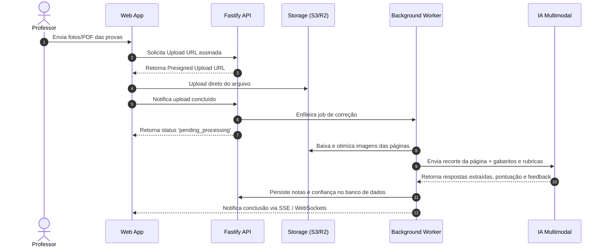

# 🏗️ Arquitetura do Sistema

Este documento descreve a visão geral da arquitetura de software, componentes e fluxo de dados do SaaS **Corretor de Prova IA**.

---

## 1. Visão Geral dos Componentes

```mermaid
graph TD
    User["👨‍🏫 Professor / Escola"] -->|HTTPS| WebApp["💻 Web App (Next.js / Frontend)"]
    WebApp -->|REST API (JSON)| API["⚡ Fastify API (@app/api)"]
    
    API -->|Queries / Mutations| DB[("🗄️ PostgreSQL + Drizzle ORM (@app/db)")]
    API -->|Upload de Imagens / PDFs| Storage["📦 Object Storage (S3 / Cloudflare R2)"]
    API -->|Enfileiramento de Provas| Queue["📨 Queue / Background Worker"]
    
    Queue -->|Processamento Visual| VisionAI["🧠 Multimodal AI Service (OCR + Rubricas)"]
    VisionAI -->|Extração e Notas| Queue
    Queue -->|Atualiza Submissões| DB
```

---

## 2. Pipeline de Correção de Provas por Scan

O fluxo de processamento de imagens escaneadas segue uma arquitetura resiliente e assíncrona:



---

## 3. Estrutura do Monorepo

- **`apps/api`**: Serviço backend em Fastify com validação Zod, rotas REST e orquestração de negócios.
- **`packages/db`**: Camada única de banco de dados com esquemas Drizzle, migrações e conexão com PostgreSQL.
- **`packages/typescript-config`**: Configurações de TypeScript centralizadas e padronizadas para todo o repositório.
- **`docs/`**: Documentação técnica, regras de negócio e modelagem de arquitetura.
