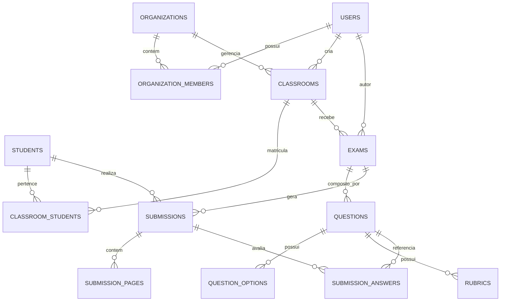

# 🗄️ Modelagem de Banco de Dados (Pré-Drizzle)

Este documento define o modelo de entidades, relacionamentos e tipos de dados do sistema antes da implementação dos schemas no **Drizzle ORM**.

---

## 1. Diagrama Entidade-Relacionamento (ER)

---

## 2. Dicionário de Dados das Tabelas

### 2.1 `users`
Armazena os professores, coordenadores e administradores da plataforma.

| Campo | Tipo | Nulo? | Descrição |
| :--- | :--- | :--- | :--- |
| `id` | `uuid` | Não | Chave primária (padrão `gen_random_uuid()`) |
| `name` | `text` | Não | Nome completo |
| `email` | `text` | Não | E-mail único do usuário |
| `password_hash` | `text` | Sim | Hash da senha (nulo se login via OAuth) |
| `avatar_url` | `text` | Sim | URL da foto de perfil |
| `role` | `enum('teacher', 'admin', 'coordinator')` | Não | Papel padrão: `teacher` |
| `created_at` | `timestamp with time zone` | Não | Data de criação |
| `updated_at` | `timestamp with time zone` | Não | Data de atualização |

---

### 2.2 `organizations` e `organization_members`
Suporte a planos institucionais (escolas, faculdades e cursinhos).

| Tabela | Campos Principais | Descrição |
| :--- | :--- | :--- |
| `organizations` | `id`, `name`, `slug`, `plan`, `created_at` | Dados da escola ou instituição |
| `organization_members` | `id`, `organization_id`, `user_id`, `role`, `joined_at` | Associação de professores à instituição |

---

### 2.3 `classrooms` & `students`
Gestão de turmas e alunos para atribuição automática nas provas digitalizadas.

- **`classrooms`**: `id`, `name`, `grade`, `subject`, `teacher_id`, `created_at`.
- **`students`**: `id`, `name`, `email`, `registration_number` (matrícula), `created_at`.
- **`classroom_students`**: `classroom_id`, `student_id`.

---

### 2.4 `exams` (Provas)
Representa a avaliação criada pelo professor (manual ou via IA).

| Campo | Tipo | Nulo? | Descrição |
| :--- | :--- | :--- | :--- |
| `id` | `uuid` | Não | Chave primária |
| `title` | `text` | Não | Título da avaliação (ex: "Prova Bimestral 1") |
| `description` | `text` | Sim | Instruções gerais |
| `subject` | `text` | Não | Disciplina (ex: "Matemática", "História") |
| `total_points` | `numeric(5, 2)` | Não | Valor total da prova (ex: 10.00) |
| `status` | `enum('draft', 'published', 'archived')` | Não | Status da prova |
| `classroom_id` | `uuid` | Sim | Turma vinculada (FK) |
| `creator_id` | `uuid` | Não | Usuário autor (FK `users`) |
| `template_pdf_url` | `text` | Sim | URL do PDF gerado pronto para impressão |
| `created_at` | `timestamp with time zone` | Não | Data de criação |

---

### 2.5 `questions`, `question_options` & `rubrics`
Estrutura detalhada de cada questão da prova.

- **`questions`**:
  - `id` (`uuid`, PK)
  - `exam_id` (`uuid`, FK `exams`)
  - `order` (`integer`, ordem da questão)
  - `statement` (`text`, enunciado)
  - `type` (`enum('multiple_choice', 'true_false', 'open_ended', 'numeric')`)
  - `max_points` (`numeric(5, 2)`, pontuação máxima da questão)
  - `expected_answer` (`text`, resposta esperada ou explicação do gabarito)

- **`question_options`** (para questões de múltipla escolha):
  - `id` (`uuid`, PK)
  - `question_id` (`uuid`, FK `questions`)
  - `letter` (`char(1)`, ex: 'A', 'B', 'C', 'D', 'E')
  - `text` (`text`, texto da alternativa)
  - `is_correct` (`boolean`, se é a alternativa correta)

- **`rubrics`** (critérios de correção detalhados para questões dissertativas):
  - `id` (`uuid`, PK)
  - `question_id` (`uuid`, FK `questions`)
  - `criterion` (`text`, ex: "Citou os dois fatores históricos principais")
  - `points` (`numeric(5, 2)`, pontuação atribuída a este critério)

---

### 2.6 `submissions`, `submission_pages` & `submission_answers`
Armazenamento das provas digitalizadas e corrigidas.

- **`submissions`**:
  - `id` (`uuid`, PK)
  - `exam_id` (`uuid`, FK `exams`)
  - `student_id` (`uuid`, FK `students`, opcional se anônimo no momento do scan)
  - `total_score` (`numeric(5, 2)`, pontuação calculada final)
  - `status` (`enum('pending_processing', 'processing', 'needs_review', 'completed', 'failed')`)
  - `corrected_at` (`timestamp with time zone`)

- **`submission_pages`**:
  - `id` (`uuid`, PK)
  - `submission_id` (`uuid`, FK `submissions`)
  - `page_number` (`integer`)
  - `image_url` (`text`, URL da imagem no bucket de storage)
  - `raw_ocr_payload` (`jsonb`, retorno bruto da extração visual/OCR)

- **`submission_answers`**:
  - `id` (`uuid`, PK)
  - `submission_id` (`uuid`, FK `submissions`)
  - `question_id` (`uuid`, FK `questions`)
  - `extracted_text` (`text`, texto/alternativa extraída pela IA)
  - `ai_score` (`numeric(5, 2)`, pontuação sugerida pela IA)
  - `final_score` (`numeric(5, 2)`, pontuação final homologada)
  - `ai_feedback` (`text`, justificativa e explicação da IA para o aluno)
  - `confidence` (`numeric(3, 2)`, taxa de confiança de 0.00 a 1.00)
  - `requires_review` (`boolean`, flag para atenção do professor)
  - `reviewed_by` (`uuid`, FK `users`, quem validou manualmente)
