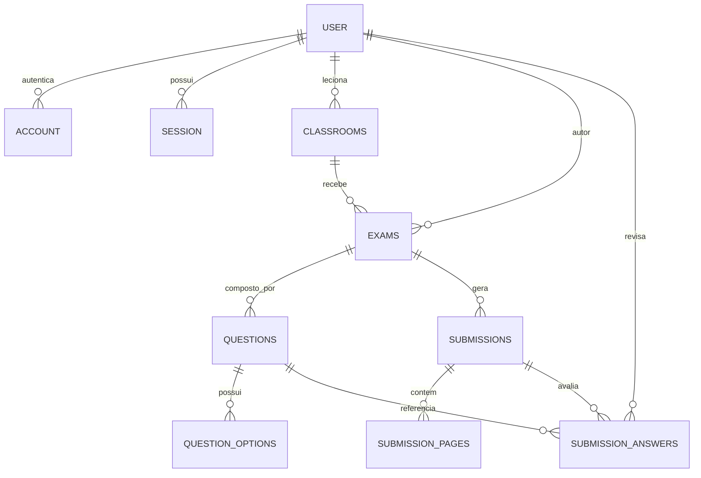

# 🗄️ Modelagem de Banco de Dados (Drizzle ORM)

Este documento define o modelo de entidades, relacionamentos e tipos de dados do sistema, refletindo os schemas implementados em `packages/db/src/schema`.

> **Fora de escopo no MVP (ver `requisitos.md`):** gestão de alunos/matrículas, organizações/instituições e questões dissertativas. Essas entidades foram removidas deste documento por não serem cobertas por nenhum requisito funcional atual.

---

## 1. Diagrama Entidade-Relacionamento (ER)

---

## 2. Dicionário de Dados das Tabelas

### 2.1 `user`, `account`, `session`, `verification` (Autenticação — `better-auth`)

Gerenciadas pelo adapter Drizzle do `better-auth` (RF01, RF02). O schema não é definido manualmente com base neste documento: é gerado a partir da configuração de `apps/api/src/lib/auth.ts` e vive em `packages/db/src/schema/{users,accounts,sessions,verifications}.ts`. Os `id` são `text` (gerados pela própria lib), não `uuid`.

| Tabela | Campos Principais | Descrição |
| :--- | :--- | :--- |
| `user` | `id`, `name`, `email`, `email_verified`, `image` | Professor cadastrado na plataforma. Não há papéis/roles no MVP — não há alunos ou administradores. |
| `account` | `id`, `account_id`, `provider_id`, `user_id`, `password` | Um método de autenticação vinculado ao usuário (senha ou Google OAuth), permitindo account linking (RF02). |
| `session` | `id`, `token`, `expires_at`, `user_id` | Sessão ativa do professor. |
| `verification` | `id`, `identifier`, `value`, `expires_at` | Tokens de verificação (ex: reset de senha, verificação de e-mail). |

---

### 2.2 `classrooms`

Turmas como "pastas organizadoras" (RN, RF03, RF04) — sem cadastro de alunos ou matrículas.

| Campo | Tipo | Nulo? | Descrição |
| :--- | :--- | :--- | :--- |
| `id` | `uuid` | Não | Chave primária (`gen_random_uuid()`) |
| `name` | `text` | Não | Nome da turma (ex: "8º Ano A") |
| `subject` | `text` | Não | Disciplina/Matéria |
| `description` | `text` | Sim | Descrição livre |
| `teacher_id` | `text` | Não | Professor dono da turma (FK `user`, `on delete cascade`) |
| `created_at` / `updated_at` | `timestamp` | Não | Auditoria |

---

### 2.3 `exams` (Provas)

Representa a avaliação criada pelo professor, manual ou via IA (RF05–RF08).

| Campo | Tipo | Nulo? | Descrição |
| :--- | :--- | :--- | :--- |
| `id` | `uuid` | Não | Chave primária |
| `title` | `text` | Não | Título da avaliação |
| `description` | `text` | Sim | Instruções gerais / prompt de geração |
| `total_points` | `numeric(5, 2)` | Não | Valor total da prova |
| `status` | `enum('draft', 'finalized')` | Não | Ciclo de vida da prova: `RASCUNHO` / `FINALIZADA` (RN) |
| `classroom_id` | `uuid` | Não | Turma vinculada (FK `classrooms`, `on delete cascade`) |
| `creator_id` | `text` | Não | Professor autor (FK `user`, `on delete cascade`) |
| `template_pdf_url` | `text` | Sim | URL do PDF pronto para impressão (RF08). O QR Code do rodapé usa o próprio `id` da prova como identificador — não há campo dedicado. |
| `created_at` / `updated_at` | `timestamp` | Não | Auditoria |

---

### 2.4 `questions` & `question_options`

Estrutura das questões. Escopo do MVP restrito a **múltipla escolha** e **verdadeiro/falso** (RN "Escopo de Questões") — sem questões dissertativas/numéricas e, portanto, sem tabela de rubrics.

- **`questions`**
  - `id` (`uuid`, PK)
  - `exam_id` (`uuid`, FK `exams`, `on delete cascade`)
  - `order` (`integer`, ordem de exibição)
  - `statement` (`text`, enunciado — pode ficar vazio no fluxo de gabarito manual, RF07)
  - `type` (`enum('multiple_choice', 'true_false')`)
  - `max_points` (`numeric(5, 2)`, pontuação máxima da questão)
  - `expected_answer` (`text`, gabarito — letra da alternativa ou `V`/`F`; único campo populado no fluxo de gabarito manual em texto corrido, RF07)

- **`question_options`** (apenas para questões `multiple_choice`)
  - `id` (`uuid`, PK)
  - `question_id` (`uuid`, FK `questions`, `on delete cascade`)
  - `letter` (`char(1)`, ex: `A`, `B`, `C`, `D`, `E`)
  - `text` (`text`, texto da alternativa)
  - `is_correct` (`boolean`, se é a alternativa do gabarito)

---

### 2.5 `submissions`, `submission_pages` & `submission_answers`

Armazenamento das folhas de resposta digitalizadas e corrigidas via visão computacional (RF09–RF12). Como o sistema **não gerencia cadastro de alunos** (RN "Sem Gestão de Alunos"), a submissão não tem FK para uma entidade "aluno" — apenas um identificador textual livre e opcional, preenchido pelo professor para diferenciar folhas dentro de uma mesma sessão de escaneamento.

- **`submissions`**
  - `id` (`uuid`, PK)
  - `exam_id` (`uuid`, FK `exams`, `on delete cascade`)
  - `student_identifier` (`text`, opcional — nome/número anotado pelo professor, sem vínculo com cadastro)
  - `total_score` (`numeric(5, 2)`, pontuação calculada final)
  - `status` (`enum('pending_processing', 'processing', 'needs_review', 'completed', 'failed')`)
  - `corrected_at` (`timestamp`)
  - `created_at` (`timestamp`)

- **`submission_pages`**
  - `id` (`uuid`, PK)
  - `submission_id` (`uuid`, FK `submissions`, `on delete cascade`)
  - `page_number` (`integer`)
  - `image_url` (`text`, URL da imagem no bucket de storage)
  - `raw_ocr_payload` (`jsonb`, retorno bruto da extração visual/OCR)
  - `created_at` (`timestamp`)

- **`submission_answers`**
  - `id` (`uuid`, PK)
  - `submission_id` (`uuid`, FK `submissions`, `on delete cascade`)
  - `question_id` (`uuid`, FK `questions`, `on delete cascade`)
  - `extracted_text` (`text`, alternativa/texto extraído pela IA)
  - `ai_score` (`numeric(5, 2)`, pontuação sugerida pela IA)
  - `final_score` (`numeric(5, 2)`, pontuação final homologada)
  - `ai_feedback` (`text`, justificativa da IA)
  - `confidence` (`numeric(3, 2)`, taxa de confiança de 0.00 a 1.00)
  - `requires_review` (`boolean`, flag de intervenção manual — RF11)
  - `reviewed_by` (`text`, FK `user`, `on delete set null` — quem validou manualmente)
  - `created_at` (`timestamp`)

---

## 3. Mudanças em relação à modelagem anterior

Este documento substitui uma versão anterior que incluía entidades sem respaldo em `requisitos.md`. Alterações feitas para alinhar o modelo ao MVP:

- **Removido:** `organizations` / `organization_members` — não há requisito de multi-tenant institucional no MVP.
- **Removido:** `students` / `classroom_students` — RN é explícita: "Sem Gestão de Alunos (Scope Cut)". `submissions` passa a usar `student_identifier` (texto livre e opcional) em vez de FK para aluno.
- **Removido:** `rubrics` e os tipos `open_ended` / `numeric` de questão — RN restringe o MVP a múltipla escolha e V/F.
- **Ajustado:** `exams.status` de `('draft', 'published', 'archived')` para `('draft', 'finalized')`, espelhando exatamente os dois estados descritos na RN (`RASCUNHO` / `FINALIZADA`).
- **Ajustado:** `users` deixou de ser uma tabela customizada (com `password_hash`, `role`, `avatar_url`) e passou a refletir o schema gerado pelo `better-auth` (`user`/`account`/`session`/`verification`, com `id` do tipo `text`), já implementado em `apps/api/src/lib/auth.ts`.
- **Ajustado:** `classroom_id` em `exams` passou a ser obrigatório — RF05 exige que o professor sempre selecione uma turma para gerar a prova.
